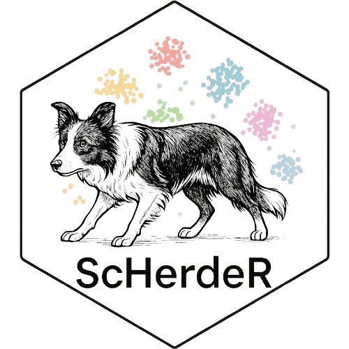

<p align="center">
  
</p>

# ScHerdeR

**ScHerdeR** is an R-based command-line pipeline for dimensionality reduction of single-cell RNA-seq data using the Seurat framework. It performs dimensionality reduction, clustering, and batch-effect diagnostics, and generates useful UMAP visualizations and cluster composition summaries by sample.


## 📦 Features

- Accepts `.rds` or `.RData` Seurat objects
- Performs dimensionality reduction (UMAP) and clustering
- Saves Seurat object with dimensionality reduction and clustering
- Exports UMAP plots grouped and split by sample identity
- Generates tables and bar plots of cell type proportions by cluster and sample
- Optional custom color mapping for customized plotting

## 🚀 Quick Start

### 🔧 Requirements

```r
install.packages(c(
  "tidyverse",
  "Seurat",
  "optparse",
  "magrittr",
  "patchwork",
  "ggplot2"
))
```

### 🖥️ Usage

```bash
Rscript ScHerdeR.R \
  --seurat_obj path/to/input_seurat.rds \
  --output_dir results_folder \
  --npc 30 \
  --resolution 0.6 \
  --reduction pca \
  --sample_ident orig.ident \
  --perc_calculation TRUE \
  --cols path/to/colors.rds
```
Run `Rscript ScHerdeR.R --help` to see all options.

### 📝 Parameters

- `--seurat_obj`  
  **(Required)** Path to a .rds or .RData file.

- `--output_dir`  
  Directory where output files will be saved. Default is `./`.

- `--npc`  
  Number of principal components. Default is `30`.

- `--resolution`  
  Clustering resolution. Default is `0.6`.

- `--sample_ident`  
  Metadata column for sample identity. Default is `orig.ident`.

- `--perc_calculation`  
  Whether to output cell composition by cluster and sample. Default is `FALSE`.

- `--mt_cutoff`  
  Percent mitochondrial cutoff for filtering.. Default is `10`.

- `--cols`  
  Optional path to color vector (.rds or .RData)

## 📂 Output

All files are saved in a timestamped subdirectory under `--output_dir` (e.g. `ScHerdeR_20250703_173045`).

- RDS files
  - seurat_obj_PC<pc>_res<res>.rds – Seurat object with PCA, clustering, UMAP
	- cell_count_by_sample.rds – cluster composition table
- Plots
  - umap.png
	- umap_grouped_by_sample.png
	- umap_split_by_sample.png
  - cell_count_by_sample.png – bar plot of cluster composition (if `--perc_calculation = TRUE`)
- Table
  -cell_count_by_sample.xlsx – same table in Excel format (if `--perc_calculation = TRUE`)

## 📌 Notes

- If multiple Seurat objects are present in an .RData, the first one is selected (with a warning).
- Seurat object should already be normalized.
